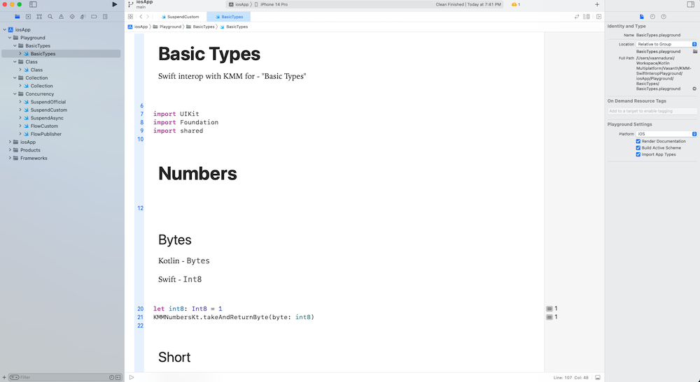

# KMM - Swift Interop Playground

The sample playground application to understand the Swift interop with Kotlin Multiplatform (KMM)
application.

## Documentation

- [Project Setup](./documentation/project_setup.md)
- [Kotlin Swift Interop Mappings](./documentation/kotlin_swift_interop.md)
    - [Concurrency Interop](./documentation/kmm_concurrency.md)

## iOS Playground

