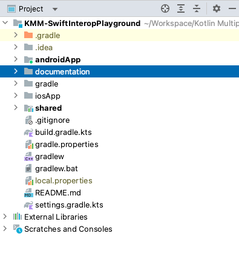
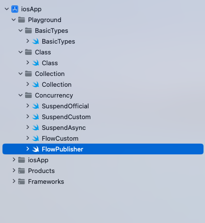

# Project Setup

<!-- TOC -->

* [Project Setup](#project-setup)
    * [Structure](#structure)
    * [iOS App](#ios-app)
        * [Structure](#structure)
        * [Build](#build)
        * [Troubleshooting](#troubleshooting)

<!-- TOC -->

### Structure

* The project follows default KMM project structure.



### iOS App

#### Structure

* In iOS project we have created Playground to explore Kotlin types in Swift.



#### Build

On building iOS app, we execute following steps

* Build XCFramework from KMM module.
* Copy XCFramework to iOS app.

```
// Xcode build phases - Run Script

# Build KMM Framework and copy it to "Framework" folder.

cd "$SRCROOT/.."
./gradlew :shared:assembleXCFramework
cp -Rf "$SRCROOT/../shared/build/XCFrameworks/release/" "$SRCROOT/framework"
```

#### Troubleshooting

**1. Error: cannot find 'KMM...Kt' in scope**

* Build the iOS App before running Playground.
* Restart the Xcode.

**2. New KMM Shared module changes not reflecting**

* Build the iOS App before running Playground.
* Restart the Xcode.


